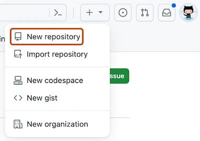

# Introduction to GitHub


GitHub is a cloud-based hosting platform for Git repositories.  Git can be used independently of Github (or competitive platforms such as Bitbucket).  Hosting repositories allows collaboration and provides cloud backups of your code.

GitHub is the largest host for Git repositories and serves as the central point of collaboration for millions of developers and projects. Many Git repositories are hosted on GitHub, and numerous open-source projects utilize it for Git hosting, issue tracking, code review, and other purposes.


- **Git is the version control system, the tool that tracks changes to our files over time**
- **Github is a hosting service for projects that use Git.**

It is essential to familiarize yourself with Git first. 

Check out Colt Steele's **Learn Git In 15 Minutes** tutorial [**here**](https://www.youtube.com/watch?v=USjZcfj8yxE) (also, you can find the Git notes [**here**](https://www.notion.so/Introduction-to-Git-ac396a0697704709a12b6a0e545db049)).


Documentation can be found directly on the GitHub website: [get started](https://docs.github.com/en/get-started/start-your-journey/about-github-and-git).

Git keeps track of changes to the source code by storing it in a (local) *repository*. With Github, a local repository can be uploaded to a remote cloud-based hosting repository. In addition, we have access to any public repositories created by other developers.

GitHub also allows users to follow, rate, and collaborate with other developers.  Multiple contributors are allowed in each repository (repo for short). 

Remote 'repos' on GitHub can be public or private. 


Sharing project portfolios with potential employers is another great use for GitHub.


GitHub homepage: [github.com](http://github.com)


## Git Configuration
As you read briefly in Getting Started, you can specify Git configuration settings with the git config command. One of the first things you did was set up your name and email address:

```zsh
$ git config --global user.name "John Doe"
$ git config --global user.email johndoe@example.com
```


# Getting started with GitHub

GitHub enables developers to access a **remote** central repository hosted in the cloud.  GitHub allows developers to access a central repository located remotely. A developer can clone (i.e., download) a local project version from the hosted remote repository. Then, new features or bug fixes are added to their local computer.  Changes can be **pushed** to the remote repository when ready, where the changes may (or may not) be incorporated.  


## Registering a GitHub account

You need a GitHub account.  

Sign up for a new account from the home page [GitHub.com](http://github.com) by selecting 'Sign up'.   The direct link to join is: [https://github.com/join](https://github.com/join)


#### **Step 1: Set up your account**

Choose a GitHub **username**, provide an **email** address (make sure to use a legitimate email since you will be required to verify the account upon finalizing), and select a (strong) **password**.  See [guidelines for strong passwords](https://its.lafayette.edu/policies/strongpasswords/).

[Set up account](https://docs.github.com/en/get-started/start-your-journey/creating-an-account-on-github)

Verify your account, then click the **'Create an account'** button at the bottom.


#### **Step 2: Choose your subscription**

Choose the **Free** subscription plan to get started using GitHub at no cost.  

After choosing the **Free** plan, click the **'Continue'** button to go to the next step.


#### **Step 3: Setup your profile**

Building a profile is an optional step, but it can be valuable in the long run.  Your profile can be developed over time.  

Finally, you need to check the inbox of the email that you provided to **verify your email address** with GitHub.


# Using GitHub

**Common Workflow: Push an Existing Repo to GitHub**

1. Add/commit your code locally
2. Go to GitHub and make a new repository
3. Connect your local repo to the GitHub repo (add a remote)
4. Push your code up to GitHub using the new remote

First, create a local repository, which will be **pushed** to GitHub.


- **Step 1: Create a new local Git repository**

Open a terminal and navigate to a directory that will store the project.  Type the following command to create a new project folder and ``cd`` into it:

```zsh
mkdir hello-world
cd hello-world
```

Initialize a new **local** Git repository by running `git init` as such:

```zsh
git init
```

An empty Git repository is now initialized.


- **Step 2: Adding a new file to our Git repository**

Create a new file in your project folder, we will call our sample file `hello.js`

You can use the graphical interface of your operating system to create the file, or use the following terminal commands:

> Windows Powershell: `ni hello.js`
Bash (Mac/Linux) terminal: `touch hello.js`

You can open the `hello.js` file with your text editor, and write the following JavaScript code which prints **Hello World!** to the console:

```jsx
console.log("Hello World!");
```

Save the file changes and then switch back to your terminal window.

- **Step 3: Making our initial commit to the local repository**

As learned [**Learn Git In 15 Minutes**](https://www.youtube.com/watch?v=USjZcfj8yxE) tutorial, run the following commands to track your files and make the initial commit in the local repository: 

```zsh
git add .
git commit -m "Initial commit"
```

Add and commit in one command:
```zsh
git commit -a -m "message"
```
Once that's done, it means we have successfully prepared our new local repository to be pushed to GitHub.

Make sure to use the `git status` command frequently when working with Git. It's a great way to check the status of your project files and the whole repository.


## Creating a new GitHub repository

To create a new GitHub repository, navigate to [github.com](http://github.com) and press the plus symbol in the top-right corner, then select the '**New repository**' option, as shown in the screenshot here:



You can also navigate to the GitHub page for creating new repositories by visiting this link: [https://github.com/new](https://github.com/new)

On that page, we first need to specify a **Repository name** and an optional **Description.**


For the **Repository name**, we can specify the same project name (**hello-world**) as the local repository that we are using in our example. If you want, you can also write a **Description** of your repository, but you can also skip that field as we did in the screenshot above.

You can set your repository to be **Public** or **Private**.

If you choose **Public**, it means anyone can see this new repository. When uploading your code to a public directory, ensure that it does not contain sensitive data that you don't wish to share with others.

On the other hand, if you choose **Private**, you can manually choose who can access the new repository.

If you wanted, you could initialize the repository with a **README** file, which usually contains information or documentation about the project. We don't need one for this simple project, so we can skip those options and click the green **'Create repository'** button to finalize the creation procedure.


### Create a new repository on the command line (Local to remote initialization)


Add a new repository in GitHub and then in the folder on your computer that you want to upload to GitHub run the following commands (changing my_username and my_project to your situation):


```zsh
git init
git add .
git commit -m "initial commit"
git remote add origin https://github.com/my_username/my_project.git
git push --set-upstream origin main
```

GitHub suggests:

```zsh
echo "# enaj" >> README.md
git init
git add README.md
git commit -m "first commit"
git branch -M main
git remote add origin https://github.com/jamesquinlan/enaj.git
git push -u origin main
```


## Pushing our code to the GitHub repository

After the last step, you will be forwarded to the starting page of your new GitHub repository.


Since we've already created our Git repo locally, we can focus on the **`…or push an existing repository from the page's command line`** section.

If we didn't already have a local repository created, then we would follow the first set of commands to create a local repository from the remote GitHub one that was just created.

The **git remote add origin** command will associate our local repository with the remote GitHub repository that we just created.  We're essentially telling your Git repo that we have a URL we want it to know about, and we give it the name "origin."  You do not have to name the remote "origin," but it is standard practice if you have only a single remote.

The **git push** command will then push our local Git repository code to the remote GitHub repository (if you chose a public repository, this would publish your code on the internet, via GitHub).

Therefore, switch back to your local terminal and run the specified commands from your project folder:

```zsh
git remote add origin https://github.com/<your-username>/<your-repo-name>.git
git push -u origin main
```

When you run the **git push** command, you will be prompted to enter your GitHub username and password to log in to your GitHub account from the terminal.

After the repository was pushed, you can navigate back to your GitHub account page or the repository link and refresh it: `https://github.com/<your-username>/<your-repo-name>`

Now, you can use that link to share your project repository with other people.


For example, anyone can click on the **hello.js** file to see the contents of our project files.

Also, other developers can **clone** the remote repository to their local computer (or **download** it) by clicking on the green button highlighted in the screenshot.

You can also see many other data from the repository, including past **commits**, existing **branches**, etc.


### Pushing a new branch

```zsh
git push --set-upstream origin NEW_BRANCH_NAME
```


## Making changes to the GitHub repository

Any changes that we make to our local project files won't automatically affect the remote GitHub repository until we **push** those changes again to update it.

For example, open the **hello.js** file with your favorite code editor and change the code to this:

```jsx
console.log("Greetings, World!");
```

Save the file changes and commit those changes to your local repository using the following commands:

```zsh
git add .
git commit -m "Change greeting"
```

Then, push your updated local repository to the remote GitHub repository with this command:

```zsh
git push origin main
```

After that, when you navigate back to your remote repository page on [github.com](http://github.com), you should see the updated code and one more **commit** in the list.


## Cloning an existing GitHub repository

Another approach would be to first create a GitHub repository online and then download it to our computer to initiate the project.

From [github.com](http://github.com), go to the **New repository** page: [https://github.com/new](https://github.com/new)

Go through the same steps, but specify a new repository name.

To **clone** the repository, visit its page and select the green **'Clone or download'** menu button, then click on the icon shown in the screenshot to copy the repository URL that we will need to use.


Then, to clone the remote repository to your computer, execute the **git clone** command with the link that you just copied:

```zsh
git clone <github-repo-link>
```

That will create a new folder with the remote GitHub repository name and download all the project files and repository data into it. You can then change directories (**cd**) into that folder and normally continue working on the project, as we learned in the previous example.

You can also clone public GitHub repositories from other developers using the same steps where you first find a copy of the repository URL and then use it in the **git clone** terminal command.


# Branching and merging

The general rule is that the **main** branch of your GitHub repository should always contain working and stable code. However, you may also want to push some code that you are currently working on, which may be unstable or not fully tested. Usually, that happens when you are adding a new feature to your code, but still want to push that code to GitHub.

We can create a separate copy of our project code with branching without touching the **main** branch that holds our stable code. Instead, we can make a new branch that creates a different version of our code, and then implement our feature. Then, when we fully integrate and test our new feature, we can merge it back to our **main** branch.


## Pushing a branch to GitHub

So, when we are working on code modifications or a new feature locally, we usually want to create a new branch for that feature. We do not make changes directly on the main **main** branch, which should only contain stable code.

For example, if we wanted to add a new file to our **hello-world** project, we can switch to a new branch by typing this from the project folder:


```zsh
git checkout -b new-feature
```


Then, you can create a new sample file called **example.js**, and add the following code:

```jsx
console.log("Hello World!");
```


After that, run the standard steps to commit the new changes to the **new-feature** branch:

```zsh
git add .
git commit -m "Add greeting"
```


To push the **new-feature** branch to the **hello-world** remote repository on GitHub, run this command:


```zsh
git push origin new-feature
```

If you refresh the **hello-world** GitHub repository page, you will see that there is a new branch pushed.


## Creating a Pull Request (PR)

We create a pull request to notify the project owner (or the team leader) that we want to implement changes from our custom branch to the main **main** branch.

The pull request will allow developers to review and verify the changes before they are applied to the **main** branch, which typically contains only the **stable** version of our code.

To create a pull request, we need to press the following button (from the same interface shown in the last screenshot)


After that, we will be redirected to a page that allows us to open a pull request. There, we can specify the title of our pull request and leave a comment describing the changes we have made.


To submit your pull request, click the green **'Create pull request'** button, as shown in the screenshot.

After that is done, other collaborators can review the pull request, analyze the code changes directly, and add their comments.

When the changes from the request are reviewed by yourself (or other team members if you are not working alone), and they don't have any conflicts with the **main** base branch, then the pull request can be approved and merged.


After you merge the pull request, it offers to delete the *new-feature* branch since the code is now added to the **main** branch.

After a successful merge, you should see the **main** branch changes, and the commits from the custom (*new-feature*) branch will also be added to the **main** branch.

Remember that the branch can conflict with the base branch in some scenarios, so the button may not be green. This happens when a change in a file conflicts with a different file, so Git cannot automatically decide which version to use. In this situation, a developer may need to manually review the code and solve the conflicts to finalize the merge.

Additionally, suppose you are the only person working on the project (or part of a small team where a designated project leader is required). In that case, you may not need to create a pull request via GitHub to integrate your changes. However, it may still be a good practice to have a complete history of project updates listed as pull requests.

Check the following GitHub guides:
[https://guides.github.com/introduction/flow/](https://guides.github.com/introduction/flow/)
[https://guides.github.com/activities/hello-world/](https://guides.github.com/activities/hello-world/)


##   Pull changes from GitHub

After making changes or merging branches via pull requests on GitHub, the remote repository may look different from the local repository on your computer. To get the latest changes from the remote GitHub repository, we use the **git pull** command.

When we are working on a team project that is hosted in a remote GitHub repository, we want to use the **git pull** command to get the latest version of the code in our **main** branch, which may have been updated by other developers on our team.

If we associated the GitHub remote repository link to the **origin** alias (like we did in the **hello-world** repository example), then we can use the following command to pull any changes from the remote repository to the main **main** branch in our local project:

```zsh
git pull origin main
```

When we are up to date with the remote branch, we can then work on further developing the project code or adding new features.


#  Forking projects on GitHub

When using GitHub, you may find yourself wanting to use someone else's repository as a starting point for your project. Also, you may wish to contribute to a third-party project, which is very popular in the open-source community. Contributing to other projects can also be a great way to build your knowledge and experience, as well as your portfolio!

The process of creating a copy of someone else's project is called **forking**.

So, a **fork** is your copy of a repository owned by someone else.

If you are looking to contribute to a project, you can create new *pull requests* from the **forked** project to offer your changes to the owners of the original repository.


##  Forking a repository

There is a sample repository called *Spoon-Knife* hosted by GitHub, which they created for testing purposes: [https://github.com/octocat/Spoon-Knife](https://github.com/octocat/Spoon-Knife)

We will be using this repository to test the **Fork** feature of GitHub. Go to the repository page by following the link above and click the '**Fork'** button.


When the process is finished, you will be taken to your copy of the *Spoon-Knife* project repository. This forked repository will be tied to your GitHub account and won't affect the original repository. To get a local version of the forked repository, you can follow the same *cloning* ****procedure that we already covered.


##   Working with a forked repository on your local machine

To **clone** the forked repository, visit its page from your GitHub profile and select the green **'Clone or download'** menu button, then click on the icon shown in the screenshot to copy the repository URL that we will need to use.


Then, to download the remote repository to your computer, execute the **git clone** command with the link that you just copied:

```zsh
git clone https://github.com/<your-username>/Spoon-Knife.git
```

That will create a new folder called *Spoon-Knife* and download all the project files and repository data. You can then change directories (**cd**) into that folder and start working on the project.

After making changes or implementing new things to the forked project, you can generally add and commit those changes as you would for any other repository.

Also, you can push the changes that you made to the forked (remote) repository tied to your GitHub account.


##  Proposing changes to the original project

After you have made changes to the project that could potentially benefit the original project you forked and want to help improve the open-source community, you can consider offering to contribute your changes.

This can be done using a similar procedure to the one we went through in the last section, by creating **pull requests** in the original project repository.

After pushing the changes that you made to your fork, you can create a **New pull request**. 


That will lead you to the new pull request page, where you can also add information about your changes.

In situations where you are trying to contribute to a third-party project of a developer that you don't know, it's essential to provide an excellent, detailed description of everything you've done. Based on that and the code changes, the original project owner can decide if they want to implement your changes to their project.

After adding information about your changes, you can finally send a new pull request to the original project owner.


# Renaming branches

To rename your branch from `master` to `main`:

1. Log in to github.com
2. Select View All Branches
3. Click the pencil icon to rename
4. To update the local clone branch, run the following:


GitHub provides the following after renaming the branch on GitHub.com.  If you have a local clone, you can update it by running the following commands.

```zsh
git branch -m master main
git fetch origin
git branch -u origin/main main
git remote set-head origin -a
```

 

> Note: the first line `git branch -m master main` renames the local branch.  The general syntax (from the main branch) is `git branch -m old new`.


You can also delete the master branch on the remote from the terminal:
```zsh
# delete the master branch on the remote
git push origin --delete master
```


Here is another blob post providing directions on renaming the Local master Branch to main

The first step is to rename the "master" branch in your local Git repositories:
```zsh
$ git branch -m master main
```

Let's quickly check if this has worked as expected:


```zsh
$ git status
```

On branch main
Your branch is up to date with 'origin/master'.

nothing to commit, working tree clean
So far, so good! The local branch has been renamed, but we now need to make some changes to the remote repository as well!

Renaming the Remote master Branch as Well

In the second step, we'll have to create a new branch on the remote named "main" - because Git does not allow us to "rename" a remote branch. Instead, we'll have to create a new "main" branch and then delete the old "master" branch.

Make sure your current local HEAD branch is still "main" when executing the following command:


```zsh
$ git push -u origin main
```


We now have a new branch on the remote named "main". Let's go on and remove the old "master" branch on the remote:

```zsh
$ git push origin --delete master
```


## Changing repository name on GitHub

If you change the name of your repo on GitHub, you will get the following message locally when pushing files to the remote.

```zsh
remote: This repository moved. Please use the new location:
remote:   https://github.com/username/new-repo.git
To https://github.com/username/old-repo.git
```

To fix this, enter the commands, 

```zsh
git remote set-url origin [updated link url https://........git]


# Alternatively, if you like the long way, it is:
git remote rm origin
git remote add origin [updated link]

```

### Removing files from GitHub

http://www.kaidez.com/remove-files-from-github/


# 7. Concluding remarks

GitHub offers the possibility of having a centralized remote repository when using Git with our project. We can publish our projects and efficiently work with other developers and teams using GitHub. We can also browse all the available open-source projects on GitHub, use them to create our projects, or contribute to someone else's project.

To learn more about GitHub and its powerful features, check their Help page and Guides:

- [https://help.github.com](https://help.github.com/)
- [https://guides.github.com/](https://guides.github.com/)

GitHub also has [a desktop application](https://desktop.github.com/), which offers a graphical user interface when working with their service. However, it's a much less popular method of using GitHub (compared to the command-line interface using a terminal).

Also, check **GitHub Gist**, which is an easy way to share your code, notes, or other snippets: [https://gist.github.com/](https://gist.github.com/)

**GitHub Pages** is a popular service for hosting web pages via GitHub. You can learn more about it here: [https://guides.github.com/features/pages/](https://guides.github.com/features/pages/)

They also have official video guides, which you can find [on this link](https://www.youtube.com/githubguides).


