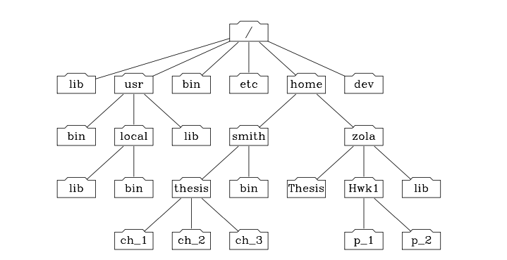

# Markdown Guide

Markdown is a lightweight markup language with plain-text-formatting syntax, created in 2004 by John Gruber with [Aaron Swartz](https://en.wikipedia.org/wiki/Aaron_Swartz).  Markdown is often used to format README files, write messages in online discussion forums, and create rich text using a plain text editor.


## Headers

The hashtag signifies headers, `#`.  The heading level is directly connected to the number of hashtags.  H1 uses one, H2 two, etc.  Here are H1, H2, H3, and H6 headers.

# Heading H1
## Heading H2
### Heading H3
###### Heading H6


## Emphasis
Emphasis text with italics, bold face, and strikethrough.  

### Italics

To italicize, wrap the text in asterisks or underscores, i.e., `_italics_`.  In particular
This *word* or *group of words* is italicized by the asterisk.  _This will also be italic_


### Bold
 Use __double__ asterisk __or__ underscores, i.e., `**bold**` or `__bold__`.  Look at the code and you will see **this is bold**, as is __this__. 


_It is also possible to  **combine** italics and boldface_.


### Strikethrough
Double tilde (`~~strike this~~`) is used to strike through text.  For example, ~~Is our children learning?~~


## Lists


### Unordered

Bullet lists use the asterisk to denote list items.   Indentation creates subitems.  In particular, 

```

* Item 1
* Item 2
  * Item 2a
  * Item 2b

```

produces the list:

* Item 1
* Item 2
	* Item 2a
	* Item 2b


### Ordered

Ordered lists (and sublists) use digits (1,2,3,...) and indentation.  The following code produces the ordered list.

The code, 
```
1. Item 1
1. Item 2
1. Item 3
  1. Item 3a
  1. Item 3b
```

yields the ordered list:

1. Item 1
1. Item 2
1. Item 3
	1. Item 3a
	1. Item 3b


## Task lists

```

-  [x] Eat 
-  [ ] Study
-  [ ] Sleep

```
renders as:

-  [x] Eat 
-  [ ] Study
-  [ ] Sleep


## Images

Images are displayed starting with the exclamation point followed by square brackets containing the alt text and path to the image in parentheses, i.e., ``.




## URL hyperlinks

Square brackets enclose the text to be hyperlinked with the URL following in parentheses. Specifically, `[Click here](https://www.website.com)`.  For example, tired of being tracked on the web?  [Search with DuckDuckGo](https://duckduckgo.com/).


## Blockquotes

> When it's all said and done, more is said than done. --  Lou Holtz


## Tables

| Left columns  | Right columns |
| ------------- |:-------------:|
| Taco		    | $1.99			|
| Pizza         | $12.50        |
| Hot Dog       | $2.25         |


## Blocks of code
Code blocks begin (and end) with three slash quotes.  The code is inserted between.

```{python}
msg  = 'Hello world'
for i in range(10):
	print(msg)
```


## Inline code
Code can be placed in a sentence such as `foo.bar` by enclosing the text by keyboard character '96' (to the left of '1' key).  


## Horizontal Line (Break)

Use three (or more) dashes to make a horizontal line.

---


### Icons

Many icons can be displayed.  Here are a few examples: a flower, :white_flower: generated by `:white_flower:` and fire, :fire: by `:fire:`.  


### Escaping characters
To escape any markdown-sensitive character, place a backslash ( \\ ) before the character. For example, `\*escape\*` the asterisk character.  If you want a backslash character, escape the backslash with a double backslash ( \\\\ ).


## Assignment Exercises

This assignment covers the basics of Markdown syntax, including headings, lists, hyperlinks, images, blockquotes, and text formatting. It also highlights the importance of converting Markdown to HTML and viewing the output in a web browser to see how it's rendered. Good luck with your Markdown practice!


1. Familiarize yourself with the basics of Markdown syntax by reading a tutorial (like above) or watching a video.

2. Create a new Markdown document using a text editor (e.g., vim) to make notes on a topic of your choice. 


3. Add a level one heading and a level two heading to the document.

4. Create an ordered list with at least three items.

5. Create an unordered list with at least three items.

6. Add a hyperlink to a website of your choice.

7. Add an image to the document and adjust its size.

8. Create a blockquote with a relevant quote or message.

8. Add emphasis to a word or phrase using bold or italic styling.

10. Save the document and convert it to HTML using a Markdown converter tool.

11. View the HTML output in a web browser to see how the Markdown syntax is rendered.

