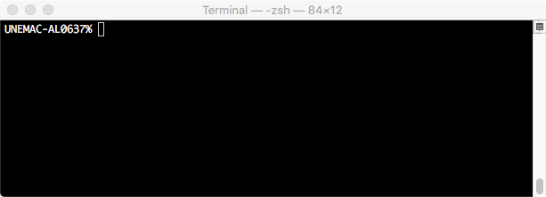

# The Unix Shell

The Unix shell is a command line interface (CLI) using a terminal.  




There are several shell renditions starting with the Thompson shell, __sh__.  Others include Bourne shell __sh__, C shell __csh__, and Korn shell __zsh__.  Two popular shells are the Bourne Again Shell __bash__ and the Z shell __zsh__.  

Although most shell commands are the same, there are some differences.  The commands presented below assume the Z-shell.  


## Basic Commands

Print Working Directory
```
$ pwd
```

List contents of directory.  The syntax for the ls command is:

```
$ ls [options] [names]
```

| Option | Description |
|:------ | :----------- |
| -a	|   Displays all files|
| -b	|   Displays nonprinting characters in octal|
| -c    |   Displays files by file timestamp|
| -C	|   Displays files in a column format (default)|
| -d	|   Displays only directories | 
| -f    | Interprets each name as a directory, not a file|
| -F	| Flags filenames |
| -g	| Displays the long format listing, but exclude the owner name|
| -i	| Displays the inode for each file|
| -l	| Displays the long format listing|
| -L	| Displays the file or directory referenced by a symbolic link|
| -m	| Displays the names as a comma-separated list|
| -n	| Displays the long format listing, with GID and UID numbers|
| -o	| Displays the long format listing, but excludes group name |
| -p	| Displays directories with / |
| -q	| Displays all nonprinting characters as ?|
| -r    | Displays files in reverse order |
| -R    | Displays subdirectories as well |
| -t	| Displays newest files first. (based on timestamp) |
| -u    | Displays files by the file access time|
| -x    | Displays files as rows across the screen|
| -1    | Displays each entry on a line |
|

__Example__: ```ls -l```


---


## Package manager


---


## Permissions


---


## Exercises

1. Open terminal window and navigate to your home directory.

2. List the files and folders in your home directory.

3. Create a new directory called `dsc227`.   
    a. Create a new text file, `test.txt`.  
    b. Rename this file, `tests.txt` and copy it to the `dsc227` folder.
    c. Remove the original file.   