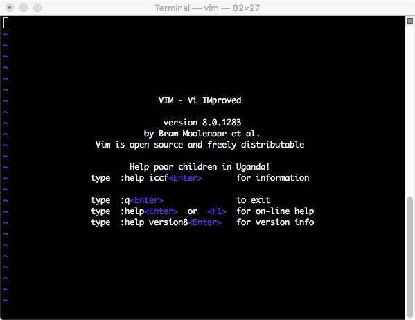

# VIM

VIM (Vi IMproved) is an open source, lightweight, powerful, and popular (modal) text editor available for Debian-based Linux, RPM-based Linux, and Windows.  (Note: MacOS is a BSD distro - Debian based).  Other editors include `vi`, `nano`, `pico`, `emacs`, `nvi`, `elvis`, ... .

See: [https://www.vim.org](https://www.vim.org)



## Installation on Debian-based Linux

First, check to see if Vim is already installed.

```
$ which vim
```

If already installed, you will see the path displayed, for example:

```
/usr/bin/vim
```

If `VIM` is not found, install it by typing the following commands at the command prompt:

```
$ sudo apt-get update
$ sudo apt-get install vim
```

To ensure Vim is correctly installed, execute the following command −

```
$ which vim
```

Or `yum install vim` with yum.

# Vim modes

Vim is a modal editor.  Keystrokes have different results based on the mode.  The modes are:

1. **Normal**: navigate the file and make edits
2. **Insert**: for inserting text
3. **Replace**: for replacing text
4. **Visual** (plain, line, or block): select text
5. **Command**: run commands

The mode is displayed in the bottom left corner (unless in normal mode).

## Normal Mode

You should be in normal mode most of the time. To enter normal mode, press the `ESC` key (from any mode).

### Movements in normal mode

* `hjkl` (left, down, up, right)
* words: `w` (next word), `b` (beginning of word), `e` (end of word)
* Lines: `0` (beginning of line), `^` (first non-blank character), `$` (end of line)
* Screen: `H` (top of screen), `M` (middle of screen), `L` (bottom of screen)
* Scroll: `^u` (up), `^d` (down)
* File: `gg` (beginning of file), `G` (end of file)
* Line numbers: `:{number}<CR>` or `{number}G` (line {number})
* Misc: `%` (corresponding item)
* Find: `f{character}`, `t{character}`, `F{character}`, `T{character}`

  * find/to forward/backward {character} on the current line
  * `,` / `;` for navigating matches
* Search: `/{regex}`, `n` / `N` for navigating matches

## Insert mode

Used to enter and edit text.  The current mode is shown at the bottom left corner of the window. To switch from default command to insert mode, press the `i` key.

To exit insert mode, use the escape key, `esc`.

## Command mode

The default mode. Commands include those in this mode, such as copy, paste, delete, and replace. Vim commands without a colon are executed in command mode.
Enter command mode with `:` from Normal mode. Functionalities in this mode include opening, saving, and closing files. Common commands in this mode include:

* `:q` quit and close the window
* `:w` save (write) buffer
* `:wq` save and quit
* `:e {filename}` open file to edit
* `:ls` list/show open buffers
* `:help {topic}`

  * `:help :w` opens help on the command `:w`
  * `:help w` opens help on `w` movement

To write to the buffer:

```
:w
```

To quit vim:

```
:q
```

To quit without saving changes:

```
:q!
```

Save changes and quit the editor with:

```
:wq
```

## Help

```
:help
:help [topic]
:help modes
```

| Command | Meaning                     |
| ------- | --------------------------- |
| `i`     | insert                      |
| `o`     | newline below (insert mode) |
| `O`     | newline above               |
| `d`     | delete                      |
| `dw`    | delete word                 |
| `u`     | undo                        |
| `y`     | yank, copy                  |
| `p`     | paste                       |
| `yy`    | copy line                   |
| `yw`    | copy word                   |
| `fo`    | find "o"                    |
| `.`     | repeats last command        |
| `4j`    | down 4 lines                |
| `c2w`   | change 2 words              |
| `2dw`   | delete 2 words              |

## Copying, Cutting, and Pasting in Vim (Normal and Visual Mode)

When working with text files, copying, cutting, and pasting are among the most commonly performed tasks. Vim uses specific terminology:

* Yank (`y`) for copy
* Delete (`d`) for cut
* Put (`p`) for paste

### In Normal Mode

#### Copying (Yanking)

* `yy`: yank the current line
* `3yy`: yank 3 lines from the cursor
* `y$`: yank from cursor to end of line
* `y^`: yank from cursor to start of line
* `yw`: yank to next word
* `yiw`: yank current word
* `y%`: yank to matching character (`()`, `{}`, `[]`)

#### Cutting (Deleting)

* `dd`: delete current line
* `3dd`: delete 3 lines
* `d$`: delete from cursor to end of line
* `dw`: delete to next word
* `d^`: delete to start of line

#### Pasting (Putting)

* `p`: paste after the cursor
* `P`: paste before the cursor

### In Visual Mode

1. Move cursor to start of selection
2. Enter visual mode:

   * `v`: character selection
   * `V`: line selection
   * `Ctrl+v`: block (column) selection
3. Move to end of selection
4. Press `y` to copy or `d` to cut
5. Move to destination and press `p` or `P` to paste

## Selection Mode

## Essential Vi Commands

Open a file:

```
vi filename
```

To go into edit mode: press ESC and type `i`

To go into command mode: press `ESC`

To save a file:

```
:w fileName
```

To save and quit:

```
:wq
```

To jump to a line:

```
:{line_number}
```

To search for a string:

```
/wordToSearch
```

To quit:

```
:q
```

## Encryption

```
vi /pathtofile/MyFile.txt
```

Then press:

```
:X
```

Enter and confirm password, then save:

```
:wq
```

### Accessing an encrypted file

Vim will prompt for the password.

### Remove encryption

1. Open the encrypted file
2. Press `:X`, hit `Enter` twice to remove password
3. Save with `:wq`

### Change encryption key

1. Open the file
2. Use `:X` to enter a new key
3. Save with `:wq`

## Customizing Vim

Vim is customized via `~/.vimrc`

## Advanced Vim

* Extend Vim with plugins
* Use multiple windows:

```
:sp / :vsp
```

## Practice Text

```
def fizz_buzz(limit):
    for i in range(limit):
        if i % 3 == 0:
            print('fizz')
        if i % 5 == 0:
            print('fizz')
        if i % 3 and i % 5:
            print(i)

def main():
    fizz_buzz(10)
```

```
The Apple Cat // modem is by far the most expandable modem on the market today...
```

## Assignment Exercises

1. Fix the following in [fizz buzz](https://en.wikipedia.org/wiki/Fizz_buzz):

   * Main is never called
   * Starts at 0 instead of 1
   * Prints 'fizz' and 'buzz' on separate lines for multiples of 15
   * Prints 'fizz' for multiples of 5
   * Hard-codes 10 instead of taking a command-line argument

2. Open a new file in Vim.

3. Write some text.

4. Search for a word.

5. Use visual mode to select text.

6. Cut and paste text.

7. Save and exit.

8. Reopen and make changes.

9. Use undo/redo.

10. Replace a word.

11. Save and exit.
